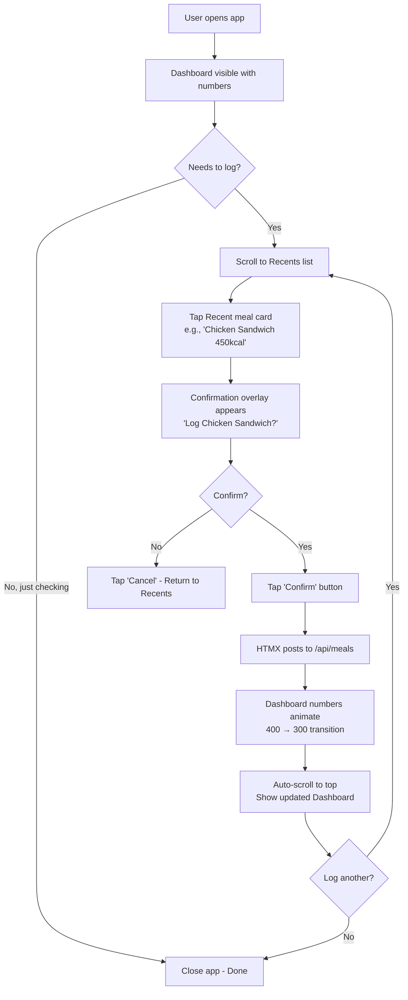
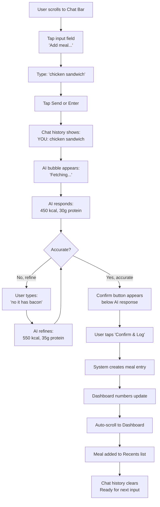
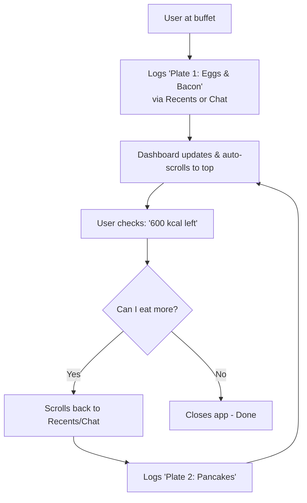
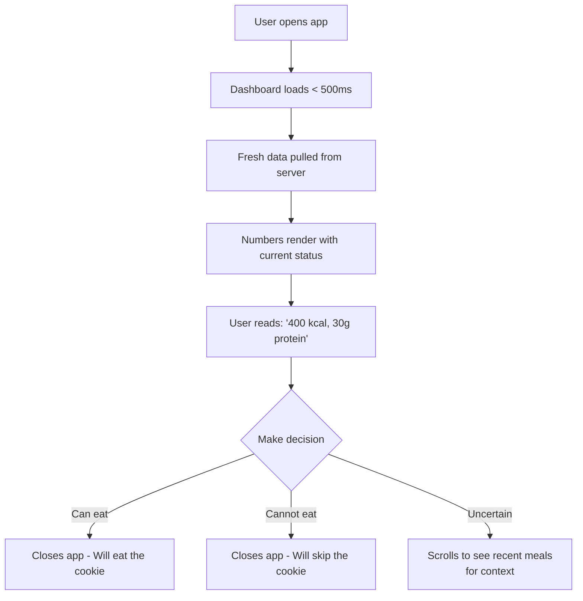

# UX Design Specification trackstack

**Author:** Hsi
**Date:** 2026-01-23

---

## Executive Summary

### Project Vision
TrackStack is a personal "Drift Detection" system for life - an early warning radar that prevents failure states (overspending, weight gain, running out of pellets). The core insight: users don't care about yesterday's data; they care about **what remains today**. The UX must deliver instant answers with zero friction while the backend serves as an SRE portfolio showcase.

### Target Users

**Primary User - The "Lazy Human" (Hsi):**
*   **Context:** 8 PM, tired after work, mobile in hand.
*   **Need:** Log meals in < 5 seconds with zero mental overhead.
*   **Success:** "Can I have that cookie?" answered instantly.

**Secondary User - The Partner:**
*   **Context:** Independent user with her own tracking goals.
*   **Need:** Same frictionless logging with complete data isolation.

**Audience - The Technical Recruiter:**
*   **Context:** 5-minute GitHub scan.
*   **Need:** Visual proof of architectural maturity.

### Key Design Challenges

1.  **The "5-Second Rule":** Any interaction taking > 5 seconds will kill adoption. The UX must prioritize speed over feature richness.
2.  **The "Zero-Click Dashboard":** The most important information (Calories Remaining, Protein Remaining) must be visible immediately upon app load with no navigation.
3.  **The "AI Uncertainty":** Voice/text input via Gemini might hallucinate or be slow. The Recents Carousel must be the reliable, always-available fallback.

### Design Opportunities

1.  **The "Glanceable Truth":** A dashboard so simple that a 1-second glance tells you everything (Traffic-light metaphor: Green = safe, Yellow = careful, Red = stop).
2.  **The "Muscle Memory" Carousel:** The 5-10 most recent meals become one-tap buttons, exploiting human habit formation.
3.  **The "Conversational Fallback":** When the AI works, it feels like magic. When it doesn't, the manual path is still fast.

---

## Core User Experience

### Defining Experience

**The Core Loop:**
The user's most frequent action is **logging a meal**. This happens multiple times per day (breakfast, lunch, dinner, snacks) and often in chaotic contexts (at a brunch buffet, watching kids, tired after work). The experience must support two distinct patterns:

1.  **The "Repeat" Pattern (80%):** "I ate the same thing I had yesterday" → 1-tap from Recents.
2.  **The "New Meal" Pattern (20%):** "I ate something new" → Text input ("chicken sandwich") → AI fetches macros → User confirms/edits → Logged.

**The Critical Interaction:**
The "New Meal" creation is the make-or-break flow. Currently, users suffer the "Gemini Detour" (switching apps, copying macros). TrackStack eliminates this by integrating Gemini directly into the input flow.

**The "Brunch Buffet" Edge Case:**
Users don't log one meal; they log iteratively ("First plate: eggs and bacon" → Check remaining → "Second plate: pancakes" → Check remaining). The UX must support rapid successive logging without resetting context.

### Platform Strategy

*   **Primary Platform:** Mobile PWA (100% for food logging).
*   **Interaction Model:** Touch-first, 1-thumb operation (right-handed assumed).
*   **Connectivity:** Always-online assumed; no offline mode needed.
*   **Input Method:** Text-first (typing), not voice (due to privacy/children context).
*   **Secondary Platform:** Desktop for future modules (Money), but not MVP.

### Effortless Interactions

1.  **Dashboard Load:** No navigation required. Open app → See "Calories Remaining: 400" and "Protein Remaining: 30g" immediately.
2.  **Recents Selection:** One tap logs a meal. No confirmation dialog.
3.  **AI Meal Creation:** Type "chicken sandwich" → AI returns macros in < 2s → One tap to confirm and log.
4.  **Iterative Logging:** After logging, user returns to Dashboard (not a success screen), ready to log again if needed (the "Brunch Flow").

### Critical Success Moments

1.  **The "Glance":** User opens app, sees "400 kcal left," and decides whether to eat the cookie (< 1 second).
2.  **The "Quick Log":** User taps "Chicken Sandwich" from Recents, sees updated "300 kcal left" (< 3 seconds total).
3.  **The "AI Magic":** User types "pizza," AI auto-fills "800 kcal, 30g protein," user taps confirm (< 5 seconds total).
4.  **The "Brunch Flow":** User logs "Plate 1" → Checks remaining → Logs "Plate 2" → Checks remaining (seamless iteration).

### Experience Principles

1.  **"Glanceable First, Detailed Never":** The Dashboard shows ONLY the two numbers that matter (Calories, Protein remaining). No charts, no history, no clutter.
2.  **"Recents Over Search":** The primary UI is a carousel of recent meals, not a search bar. Exploit habit, not memory.
3.  **"AI as Assistant, Not Gatekeeper":** If Gemini is slow/unavailable, manual numeric entry is always 1 tap away.
4.  **"Iteration Over Finality":** After logging, return to Dashboard (ready to log again), not a "Success" confirmation screen.

---

## Desired Emotional Response

### Primary Emotional Goals

**1. Control**
Users should feel in command of their data and their decisions. The "Remaining" numbers give them agency: "I have 400 kcal left - I can choose to have that cookie or save it for dinner." This is not judgment; it's information that empowers choice.

**2. Efficiency + Freedom (Mental Unload)**
Logging should feel so fast and effortless that it removes the mental burden of "Should I track this or not?" The answer is always "Yes, because it takes 3 seconds." This freedom from decision fatigue is the core value.

**3. Playful Discipline (Game-Like)**
The "Brunch Flow" should feel like a strategic game: "How much can I eat and still stay green?" It's disciplined tracking, but with a light, exploratory tone (not shame-based).

**4. Discipline**
Users should feel the satisfaction of maintaining a habit. Every day logged is a "win." The UX should reward consistency without being preachy.

### Emotional Journey Mapping

**First Use (Discovery):**
*   **Feeling:** Curiosity + Skepticism ("Will this actually be faster than my current flow?")
*   **UX Goal:** Prove value within 30 seconds (fast onboarding, immediate "Aha" moment).

**During Core Action (Logging):**
*   **Feeling:** Efficiency + Relief ("That was so easy!")
*   **UX Goal:** Zero friction, visible progress (numbers update instantly).

**After Task (Dashboard Review):**
*   **Feeling:** Control + Confidence ("I know exactly where I stand.")
*   **UX Goal:** Clear visual feedback (traffic-light colors: green/yellow/red).

**Return Visit (Habit Formation):**
*   **Feeling:** Discipline + Momentum ("Day 7 in a row!")
*   **UX Goal:** Subtle streak tracking or consistency indicators.

### Micro-Emotions

**Trust (The AI):**
*   **When:** User types "chicken sandwich" and AI returns "450 kcal."
*   **Feeling:** "That looks right" (not "Is this hallucinating?")
*   **UX Implication:** Show AI confidence score or allow quick edit if wrong.

**Accomplishment (The Log):**
*   **When:** User taps "Log" and sees the Dashboard update.
*   **Feeling:** Micro-satisfaction (not a big celebration, just "Done.")
*   **UX Implication:** Smooth animation (number transition), no modal dialogs.

**Calm (The Glance):**
*   **When:** User opens app just to check status.
*   **Feeling:** Calm reassurance ("I'm on track. I can relax.")
*   **UX Implication:** Large, clear numbers with color-coded status.

### Design Implications

**For Control:**
*   **Dashboard:** Big, bold "Remaining" numbers front and center.
*   **Visual Cues:** Traffic-light colors (Green = safe zone, Yellow = approaching limit, Red = over).

**For Efficiency + Freedom:**
*   **Recents Carousel:** Horizontal swipe, one-tap logging (no confirmation).
*   **AI Integration:** Inline, not a separate screen (type in place, results appear).

**For Playful Discipline:**
*   **Progress Bars:** Visual "fill" showing how much budget is consumed (game-like).
*   **Brunch Flow:** Rapid successive logging feels like building a combo (not tedious data entry).

**For Discipline:**
*   **Streak Indicator:** Subtle "7 days logged" badge (not intrusive, just affirming).
*   **Consistency Over Perfection:** No shame if user goes "Red." Just data.

### Emotional Design Principles

1.  **"Instant Gratification":** Every action has immediate visual feedback (no spinners, no waiting).
2.  **"No Judgment, Just Data":** Red doesn't mean "bad." It means "information." The tone is neutral, not moralizing.
3.  **"Celebrate the Habit, Not the Outcome":** Reward logging consistency, not calorie perfection.
4.  **"Fail Gracefully":** If AI is slow, show "Fetching..." then gracefully offer manual input (no error screens).

---

## UX Pattern Analysis & Inspiration

### Inspiring Products Analysis

**Trade Republic (Mobile Banking):**
*   **Core Strength:** Bold minimalism with dark mode + simple white elements.
*   **Visual Language:** Large numbers dominate the screen (portfolio value front-and-center). Zero decorative elements.
*   **Tone:** Feels like a professional power tool, not a consumer toy.
*   **Key Pattern:** Information hierarchy through size/contrast, not color or icons.

**CBC Banking Chatbot:**
*   **Core Strength:** Conversational workflow orchestration without leaving the chat interface.
*   **Interaction Model:** User states intent ("Transfer $500") → Bot executes multi-step workflow → User never navigates menus.
*   **Trust Building:** Bot confirms actions before executing, making complex tasks feel safe.
*   **Key Pattern:** Natural language as primary navigation, structured UI as fallback.

### Transferable UX Patterns

**From Trade Republic → TrackStack Dashboard:**
*   **Bold Number Hierarchy:** "400" (remaining calories) is 3x larger than any other text on screen.
*   **Dark Mode First:** Reduce eye strain for evening usage (8 PM context).
*   **Minimalist Chrome:** No header navigation, no bottom tabs. Just data and action.

**From CBC Chatbot → TrackStack AI Input:**
*   **Persistent Chat Bar:** A text input bar is always visible (bottom of screen), like a messaging app.
*   **Contextual Actions:** After typing "chicken sandwich," the bot doesn't just return data—it shows an actionable "Log This Meal" button.
*   **Workflow Continuity:** After logging, the chat bar remains active for the next input (supporting the "Brunch Flow").

**Hybrid Pattern (TrackStack Innovation):**
*   **Recents as "Quick Replies":** Like chat apps with suggested responses, show recent meals as tap-able chips above the chat bar.
*   **Dual Input Mode:** Chat bar for new meals (AI), Quick Reply chips for repeats (Recents). Best of both worlds.

### Anti-Patterns to Avoid

**Form-Based Entry:**
*   **Why Avoid:** Requires multiple fields (Name, Calories, Protein, Carbs, Fat) and explicit "Submit" action. Kills the 5-second rule.
*   **Alternative:** Chat-based or single-tap from Recents.

**Navigation Menus:**
*   **Why Avoid:** Requiring users to tap "Add Meal" → Select Category → Fill Form adds 3+ interactions.
*   **Alternative:** Chat bar and Recents are always visible. No navigation required.

**Success Screens / Confirmations:**
*   **Why Avoid:** Modal dialogs saying "Meal Logged!" interrupt the "Brunch Flow."
*   **Alternative:** Instant Dashboard update (the updated "Remaining" number is the confirmation).

**Historical Views:**
*   **Why Avoid:** Users don't care about "What did I eat 3 days ago?" It's clutter that distracts from "What remains?"
*   **Alternative:** Dashboard shows ONLY today's state. History is a separate, optional view (if ever implemented).

### Design Inspiration Strategy

**What to Adopt:**
*   **Trade Republic's Visual Power:** Dark mode, bold numbers (80px+ font size for "Remaining"), high contrast.
*   **CBC's Chat Continuity:** Persistent input bar, conversational workflow.

**What to Adapt:**
*   **Chat as "Command Line":** Unlike CBC (which handles complex multi-step workflows), TrackStack's chat is single-purpose: "Parse this meal." Keep it simple.
*   **Recents as "Quick Replies":** Borrow the chat UI pattern (chips above input) but use it for meal history, not bot suggestions.

**What to Avoid:**
*   **Over-Conversational AI:** No "How can I help you today?" prompts. Just a text box that says "Add meal..." (placeholder).
*   **Navigation Complexity:** No hamburger menus, no tabs. If it's not on the home screen, it doesn't exist (for MVP).

---

## Design System Foundation

### Design System Choice

**Selected System:** Tailwind CSS (Utility-First Framework)

### Rationale for Selection

1.  **Perfect Stack Alignment:** Tailwind is purpose-built for server-side rendering (Go Templ + HTMX). No JS framework conflicts. The build process generates a single, optimized CSS file embedded in your Go binary.

2.  **Centralized Design Tokens:** Despite appearing "scattered" in classes, the actual design system lives in `tailwind.config.js`. Define colors, spacing, typography once; use everywhere via utility classes.

3.  **Dark Mode Native:** `dark:` prefix handles Trade Republic aesthetic trivially. No custom media queries needed.

4.  **Component Extraction:** Templ allows wrapping verbose Tailwind classes into semantic components (`<DashboardNumber>` → renders with all utility classes internally). You write verbose classes once, reuse clean components.

5.  **Minimal Bundle Size:** Tailwind's purge/tree-shaking removes unused classes. Final CSS is ~10KB for a minimal app (critical for <€7 budget and mobile performance).

### Implementation Approach

**Phase 1: Token Definition (tailwind.config.js)**
```js
module.exports = {
  theme: {
    extend: {
      colors: {
        'status-safe': '#10b981',      // Green
        'status-warn': '#f59e0b',      // Yellow  
        'status-danger': '#ef4444',    // Red
        'bg-primary': '#0a0a0a',       // Dark background
        'text-primary': '#ffffff',     // White text
      },
      fontSize: {
        'dashboard-number': '80px',    // "400" remaining
        'dashboard-label': '14px',     // "kcal remaining"
        'recent-chip': '16px',         // Recent meal buttons
      },
      spacing: {
        'dashboard-gap': '32px',       // Space between elements
      }
    }
  }
}
```

**Phase 2: Templ Component Library**
Build reusable components that wrap Tailwind classes:
*   `<DashboardNumber value="400" status="safe">` → Renders with `text-dashboard-number text-status-safe`
*   `<RecentChip label="Chicken Sandwich">` → Renders with tap-able styling
*   `<ChatInput placeholder="Add meal...">` → Bottom-fixed input bar

**Phase 3: HTMX Integration**
*   Use `hx-post`, `hx-swap` for dynamic updates (log meal → update dashboard numbers without page reload).
*   Tailwind classes define visual state; HTMX handles interactivity.

### Customization Strategy

**Custom Components Needed:**
*   **Dashboard Card:** Not a standard Tailwind component. Custom layout with bold numbers + color-coded borders.
*   **Recent Meal Chips:** Horizontal scroll container with pill-shaped buttons (similar to chat "Quick Replies").
*   **Chat Input Bar:** Fixed-bottom input with "Send" icon (Tailwind provides positioning, custom styling for chat aesthetic).

**Standard Components Used:**
*   **Buttons:** Tailwind defaults with custom color tokens.
*   **Progress Bars:** Tailwind `bg-` utilities for fill percentage.
*   **Forms:** Minimal use (only Settings screen for target configuration).

**Design System Evolution:**
*   **MVP:** Minimal token set (5 colors, 3 font sizes, basic spacing).
*   **Phase 2:** Add Money/Heating modules → Expand tokens for new visualizations (charts, trends).
*   **Phase 3:** Multi-user → Add avatar/profile components.

---

## Defining Core Experience

### The Defining Experience: "The Instant Glance"

**Core Interaction:**
"Open app → See '400 kcal, 30g protein remaining' → Make decision → Close app (or log)."

This is fundamentally different from every other tracking app. They all say "Look what you DID." TrackStack says "Here's what you CAN DO."

### User Mental Model

**Current Mental Model (Before TrackStack):**
Users think of tracking as "recording history" - a chore done at the end of the day to see if they "succeeded" or "failed." The emotional frame is retrospective judgment.

**TrackStack Mental Model (New):**
Tracking becomes "checking capacity" - a real-time utility consulted before making decisions. The emotional frame is forward-looking empowerment.

**Mental Model Shift:**
*   **Old:** "Did I eat too much today?" (past tense, guilt-based).
*   **New:** "Can I eat this now?" (present tense, decision-based).

### Success Criteria for Core Experience

**The "Instant Glance" succeeds when:**
1.  **Speed:** Dashboard loads in < 500ms (no perceived delay).
2.  **Clarity:** User comprehends their status in < 1 second (no cognitive load).
3.  **Action:** User makes a decision (eat/don't eat) based on the glance.
4.  **Trust:** User believes the numbers are accurate (no "Is this right?" anxiety).

**Success Indicators:**
*   User can answer "Can I have X?" without scrolling or tapping.
*   Color-coded status is understood without reading labels.
*   User closes app without confusion or searching for more info.

### Novel vs. Established Patterns

**Established Pattern (Adopted):**
*   **Dashboard-First UI:** Banking apps (Trade Republic, Revolut) use this pattern. Users understand "Open app → See key number."

**Novel Pattern (Innovated):**
*   **"Remaining" Focus:** Most trackers show "Consumed" (e.g., "You ate 1,600 kcal"). TrackStack inverts this to "Remaining" (e.g., "400 kcal left"). This is a subtle but powerful cognitive reframe.

**User Education:**
*   **Minimal Required:** The concept of "Budget - Spent = Remaining" is intuitive (users know this from bank accounts).
*   **Visual Reinforcement:** Progress bar shows "fill" direction (consumed portion), making the "Remaining" number visually obvious.

### Experience Mechanics

**1. Initiation (App Launch):**
*   **User Action:** Taps TrackStack icon from mobile home screen.
*   **System Response:** < 500ms load → Dashboard renders immediately (server-side rendered HTML).
*   **Visual State:** Dark background, bold white/green numbers dominate viewport.
*   **No Friction:** Zero login prompts (session persists), zero splash screens, zero onboarding modals.

**2. Interaction (The Glance - Core Value Delivery):**
*   **User Action:** Eyes scan screen for ~1 second.
*   **Visual Hierarchy:**
    *   **Hero Element:** "400" (remaining kcal) - 80px, color-coded (green/yellow/red).
    *   **Secondary Hero:** "30g" (remaining protein) - 60px, same color logic.
    *   **Labels:** "kcal remaining" / "protein remaining" - 14px, muted gray.
    *   **Progress Bars:** Thin horizontal bars below each number (optional visual reinforcement).
*   **Color Logic:**
    *   Green: >20% budget remaining (safe to eat more).
    *   Yellow: 5-20% remaining (caution, budget running low).
    *   Red: <5% or over budget (stop eating or accept overage).
*   **Decision Made:** User knows instantly: "I can have the cookie" or "I should skip it."

**3. Feedback (Continuous Status Awareness):**
*   **Color Code:** The number color IS the feedback (no separate indicator needed).
*   **Progress Bar (Optional):** Subtle visual showing consumed vs. total (e.g., 60% filled = 40% remaining).
*   **No Loading States:** Numbers are pre-rendered on server; dashboard never shows "Loading..."

**4. Completion:**
*   **Scenario A (Glance Only):** User got their answer. Closes app or switches to another task. Mission accomplished in < 2 seconds.
*   **Scenario B (Logging Needed):** User scrolls down (or dashboard has visible Recents below) to log a meal, then returns to top to see updated numbers.

---

## Visual Design Foundation

### Color System

**Primary Palette (Dark Mode First):**
*   **Background:** `#0a0a0a` (near-black, Trade Republic style)
*   **Text Primary:** `#ffffff` (pure white, maximum contrast)
*   **Text Muted:** `#94a3b8` (slate-400, for labels)

**Semantic Status Colors (Traffic Light):**
*   **Safe (Green):** `#10b981` - Used when >20% budget remaining
*   **Warn (Yellow):** `#f59e0b` - Used when 5-20% budget remaining
*   **Danger (Red):** `#ef4444` - Used when <5% or over budget

**Functional Colors:**
*   **Border Subtle:** `#1f2937` (gray-800, for card edges)
*   **Interactive:** `#3b82f6` (blue-500, for chat input focus state)

**Color Usage Philosophy:**
*   **Minimalism:** Only 5 colors total. No gradients, no decorative colors.
*   **Meaning:** Color conveys status, not decoration. Green/Yellow/Red have universal meaning.
*   **Accessibility:** All text meets WCAG AA contrast (4.5:1 minimum on dark background).

### Typography System

**Font Stack (System Fonts):**
```css
font-family: -apple-system, BlinkMacSystemFont, "Segoe UI", Roboto, "Helvetica Neue", Arial, sans-serif;
```
*   **Rationale:** Zero web font loading (instant render). Native platform appearance. Tiny bundle size.

**Type Scale:**
*   **Dashboard Hero:** 80px / Bold (700) - The "400" remaining number
*   **Dashboard Secondary:** 60px / Bold (700) - The "30g" protein number
*   **Labels:** 14px / Regular (400) - "kcal remaining"
*   **Recent Chips:** 16px / Medium (500) - Meal names
*   **Chat Input:** 16px / Regular (400) - Text entry
*   **Body Text:** 16px / Regular (400) - Settings, forms (minimal use)

**Typographic Hierarchy:**
*   **Level 1 (Hero):** Dashboard numbers only. Nothing else uses 80px.
*   **Level 2 (Secondary):** Protein number, important CTAs.
*   **Level 3 (Default):** All interactive elements (chips, buttons, inputs).
*   **Level 4 (Muted):** Labels, helper text.

**Line Height:**
*   **Dashboard Numbers:** 1.0 (tight, for visual impact)
*   **Body/Interactive:** 1.5 (comfortable reading/tapping)

### Spacing & Layout Foundation

**Base Unit:** 8px (Tailwind's `spacing` scale)

**Spacing Scale (Semantic):**
*   **xs:** 8px - Tight padding (chip interiors)
*   **sm:** 16px - Standard container padding
*   **md:** 24px - Section spacing
*   **lg:** 32px - Dashboard number gap
*   **xl:** 48px - Major section breaks

**Layout Principles:**
*   **Single Column:** Mobile-first, no multi-column layouts (MVP).
*   **Vertical Stack:** Elements stack vertically with consistent spacing.
*   **Safe Zones:** 16px padding on left/right edges (iOS notch avoidance).
*   **Fixed Bottom:** Chat input bar is fixed to bottom (always accessible).

**Touch Targets:**
*   **Minimum Size:** 44px × 44px (iOS Human Interface Guidelines).
*   **Spacing Between:** Minimum 8px gap to prevent mis-taps.

### Accessibility Considerations

**Contrast Ratios:**
*   **White on Black:** 21:1 (exceeds WCAG AAA)
*   **Green on Black:** 4.8:1 (meets WCAG AA)
*   **Yellow on Black:** 10.4:1 (exceeds WCAG AA)
*   **Red on Black:** 5.3:1 (meets WCAG AA)

**Touch Accessibility:**
*   **All Interactive Elements:** Minimum 44px tap target.
*   **Clear Focus States:** Blue outline on keyboard navigation (for desktop future-proofing).

**Readability:**
*   **Font Size:** Minimum 16px for body text (no zooming required on mobile).
*   **Line Length:** Max 60 characters for any multi-line text (readability).

**Motion:**
*   **Reduced Motion Support:** Honor `prefers-reduced-motion` for users sensitive to animations.
*   **Smooth Transitions:** 150ms duration for number updates (not jarring).

---

## Design Direction Decision

### Design Directions Explored

Four design direction variations were generated exploring different approaches to layout, information density, and interaction patterns:

1.  **Classic Minimal:** Centered vertical stack with maximum number size and horizontal Recents scroll
2.  **Progress-First:** Progress bars for visual "fill" feedback with grid-based Recents
3.  **Card-Based:** Compact side-by-side cards with list-style Recents showing calorie previews
4.  **Ultra Minimal:** Absolute minimalism with 96px numbers and minimal chrome

### Chosen Direction

**Hybrid: "Progress-Enhanced Cards"**

**Composition:**
*   **Dashboard (Top):** Direction 2's progress bar treatment - numbers with horizontal bars showing consumed percentage
*   **Recents (Middle):** Direction 3's vertical list style with meal names + calorie previews
*   **Chat Bar (Bottom):** Direction 3's rounded input with fixed-bottom positioning

### Design Rationale

**Why Progress Bars (Direction 2):**
*   Supports the "Playful Discipline" emotional goal - users see their budget "filling" like a game meter
*   Visual reinforcement of the "Remaining" concept (bar shows consumed, number shows what's left)
*   Adds game-like feedback without adding cognitive load

**Why List-Style Recents (Direction 3):**
*   More information density - showing calories in the Recents list helps users make informed decisions
*   Vertical list is easier to scan than horizontal scroll on mobile
*   Each item has space to show both name and macros (better than just name)

**Why Rounded Chat Bar (Direction 3):**
*   Softer, more approachable aesthetic than stark geometric layouts
*   Visually distinct from Recents (clear separation of "Quick Log" vs "New Meal" actions)
*   Rounded corners feel more mobile-native (iOS design language)

### Implementation Approach

**Component Architecture:**
*   **MetricWithProgress:** Templ component accepting `value`, `total`, `label`, `status` → Renders number + progress bar
*   **RecentMealCard:** Templ component accepting `name`, `calories`, `protein` → Renders tap-able list item
*   **ChatInput:** Fixed-bottom input with HTMX `hx-post="/api/meals/parse"` for AI integration

**Layout Structure:**
```
┌─────────────────────────┐
│  [Dashboard]            │
│  400 kcal (progress)    │
│  30g protein (progress) │
├─────────────────────────┤
│  [Recents List]         │
│  □ Chicken Sandwich 450 │
│  □ Pizza Slice 320      │
│  □ Greek Salad 280      │
├─────────────────────────┤
│  [Chat Bar - Fixed]     │
│  [Add meal...      ] 📤 │
└─────────────────────────┘
```

**Interaction Flow:**
1.  User opens app → Dashboard visible (no scroll)
2.  User scrolls down → Recents list revealed → Tap to log (HTMX swap)
3.  User continues scrolling → Chat bar always visible at bottom → Type for AI assist
4.  After any log action → Page scrolls back to top → Dashboard updates

---

## User Journey Flows

### Journey 1: Quick Log from Recents (The "Repeat" Pattern)

**Journey Goal:** Log a previously eaten meal in < 3 seconds with minimal cognitive load.

**User Flow:**



**Key Design Elements:**
*   **Confirmation:** Lightweight overlay (not modal) showing "Log [Meal Name]?" with Confirm/Cancel buttons
*   **Animation:** Number transition uses CSS transform (scale slightly then settle) - 150ms duration
*   **Auto-scroll:** Smooth scroll to top after logging (supports "Brunch Flow")
*   **Recents Access:** Recents list is NOT always visible - user scrolls to reveal (keeps Dashboard clean)

**Success Metrics:**
*   Total time: < 3 seconds (tap Recent → confirm → see updated Dashboard)
*   Zero navigation required
*   Supports rapid iteration (immediate return to Recents after auto-scroll to Dashboard)

### Journey 2: AI-Assisted New Meal (The "Conversational" Pattern)

**Journey Goal:** Create and log a new meal via LLM conversation, refining until accurate.

**User Flow:**



**Key Design Elements:**
*   **Chat History UI:** Messages stack vertically (user messages right-aligned, AI left-aligned, like iMessage)
*   **AI Loading State:** "Fetching..." bubble appears immediately (< 100ms) to show system responsiveness
*   **Refinement Loop:** User can send multiple messages to refine before confirming
*   **Confirm Button:** Only appears after AI provides nutritional data (contextual action)
*   **History Clear:** After logging, chat clears to prevent confusion (fresh slate for next meal)

**Success Metrics:**
*   First-time AI accuracy > 70% (minimal refinement needed)
*   Refinement loop completion < 10 seconds (for complex meals)
*   Zero app-switching required (no "Gemini Detour")

### Journey 3: The Brunch Buffet (Iterative Logging)

**Journey Goal:** Log multiple meals in rapid succession with status checks between each.

**User Flow:**



**Key Design Elements:**
*   **Auto-scroll to Dashboard:** After each log, user sees updated "Remaining" numbers immediately
*   **Fast Return to Input:** User can quickly scroll back down to log next item (no navigation reset)
*   **Visual Progress:** Watching the "Remaining" number decrease and color change (green → yellow → red) creates game-like tension
*   **No Interruptions:** No success modals, no "Are you sure?" prompts between logs

**Success Metrics:**
*   Time between successive logs: < 5 seconds (including glance at updated Dashboard)
*   User can log 3+ items in < 20 seconds total
*   Zero friction or "state reset" between iterations

### Journey 4: The Dashboard Glance (Passive Check)

**Journey Goal:** Check current status without taking any action.

**User Flow:**



**Key Design Elements:**
*   **Always Fresh:** Every app launch triggers a server fetch (no stale cached numbers)
*   **Pure Passive:** No interaction required - open → glance → close
*   **No Pull-to-Refresh:** Data is always fresh on load (no manual refresh gesture needed)

**Success Metrics:**
*   Load time: < 500ms (perceived as instant)
*   User comprehension: < 1 second glance
*   Total journey time: < 2 seconds (open → decision → close)

### Journey Patterns

**Pattern: Auto-Scroll After Action**
*   After logging (Recents or Chat), page auto-scrolls to Dashboard to show updated numbers
*   Supports "Brunch Flow" by providing immediate feedback
*   User can quickly scroll back down to continue logging

**Pattern: Confirmation for Destructive Actions**
*   Logging from Recents: Lightweight confirmation (prevents accidental taps)
*   AI Chat: Explicit "Confirm & Log" button (user controls when to commit)
*   Editing/Deleting: Confirmation required (data integrity)

**Pattern: Persistent Chat Context**
*   Chat bar is always visible at bottom (fixed position)
*   Chat history persists during refinement loop
*   History clears after successful log (fresh slate for next meal)

### Flow Optimization Principles

1.  **Minimize Scroll Distance:** Dashboard at top, Chat at bottom (fixed). Recents in middle. Minimal vertical travel.
2.  **Immediate Feedback:** Every action updates Dashboard numbers within 150ms (perceived as instant).
3.  **Error Prevention:** Confirmation overlays prevent accidental logs. AI refinement prevents bad data.
4.  **Flow Continuity:** Auto-scroll returns user to Dashboard (the "truth"), ready for next action.
