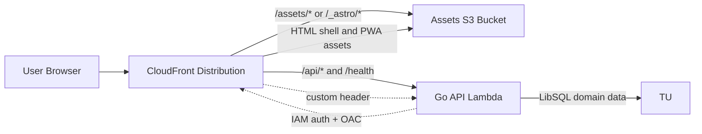

# Architecture

This document defines the macro system flow and the strict boundaries between frontend, server, and infrastructure. It is a constraint for future changes.

## Request Flow



Key points:
- CloudFront is the single public entrypoint.
- Static assets (`/assets/*`, `/_astro/*`) are served from S3 with optimized caching.
- The Astro frontend is built as static assets and served from S3.
- Business routes, auth routes, and health checks are served by the Go runtime.
- CloudFront adds origin verification headers and the Lambda entrypoints remain private behind CloudFront.

## Go Backend Shape

The Go backend is the long-term source of truth for domain logic and API contracts.

Current implemented layout in `apps/server/`:

```text
apps/server/
├── cmd/
│   ├── lambda/              # Lambda Function URL entrypoint for serverless runs
│   └── server/              # HTTP server entrypoint used in local/container runs
├── internal/
│   ├── app/
│   │   └── bootstrap/       # composition root and runtime assembly
│   ├── core/                # shared technical config, db, logging
│   ├── modules/             # domain logic, DTOs, ports, db adapters
│   ├── transport/
│   │   └── http/            # router, middleware, handlers, OpenAPI
│   └── wiring/              # composition helpers per domain
```

Possible expansion path for later phases:

- `cmd/service/<domain>/` only if domains are extracted into separate services

### Backend Principles

- Hexagonal architecture: domain logic lives in `internal/modules/**`; transport and runtime wiring stay outside modules.
- Stateless compute: runtime state lives in Turso; no local-disk dependency is part of the design contract.
- Transport isolation: HTTP, Lambda, and any future service transport must reuse the same module services.
- Environment-driven database mode: Turso DSNs are selected from config so the same backend can run in local/container and serverless environments.

### Module Contract

Each domain module follows the same shape:

```text
internal/modules/<domain>/
├── ports.go
├── types.go
├── service.go
└── adapters/
    └── db/
```

Hard boundaries:

- Modules do not import transport or AWS packages.
- Transport depends on modules, never the reverse.
- DB adapters implement module ports.
- Cross-domain access should go through ports owned by the consuming module.
- If domains are split later, outbound adapters live with the consumer and inbound transport adapters live with the provider.

### Heat Migration Slice

The first backend migration slice now starts in `apps/server/internal/contexts/heat/`.

Current transitional shape:

- `apps/server/internal/contexts/heat/domain` owns refill and season/date rules.
- `apps/server/internal/contexts/heat/application/ports` owns use-case-shaped heat ports.
- `apps/server/internal/contexts/heat/application/services` owns heat use cases.
- `apps/server/internal/contexts/heat/adapters/outbound/db` owns the Turso SQL implementation.
- `apps/server/internal/contexts/heat/adapters/inbound/http` now owns heat HTTP route mounting and request translation.
- `apps/server/internal/contexts/heat/application/service.go` is now the primary heat application facade used by runtime assembly and transport wiring.
- `apps/server/internal/app/bootstrap` is now the active composition root and assembles the heat runtime directly.
- `apps/server/internal/transport/http/dashboard.go` now consumes the heat dashboard use case through a context-local application contract.
- The legacy `apps/server/internal/modules/heat` package has been removed; heat now lives fully under `apps/server/internal/contexts/heat/**`.

This slice is intentionally incremental: the heat context now owns core business and persistence boundaries, and heat runtime assembly has moved into the composition root, while other domains still rely on legacy wiring helpers.

The rebuild workspace in `apps/server-next/` now proves the same boundary direction with canonical heat refill routes for `GET /api/heat/refills`, `POST /api/heat/refills`, `DELETE /api/heat/refills/{id}`, and `GET /api/heat/dashboard`, while auth remains intentionally mocked at the inbound HTTP boundary during the migration slice.

### Transport Contract

The current Go transport is JSON-over-HTTP under `/api/*`.

- Router: `apps/server/internal/transport/http/router.go`
- OpenAPI: `GET /openapi.yaml`
- Auth middleware: cookie-based session auth in `apps/server/internal/transport/http/middleware_auth.go`, applied only to protected route groups under `/api/*`
- Response helpers: `apps/server/internal/transport/http/response.go`
- Canonical expenses routes: `/api/expenses/settings`, `/api/expenses/sheet/current`, `/api/expenses/entries`, `/api/expenses/checklists`, `/api/expenses/checklists/complete`, `/api/expenses/recurring`, `/api/expenses/sheet/close`

Current error contract is intentionally simple:

- HTTP status carries the main classification
- JSON errors use `{ "error": "..." }`
- Go auth endpoints under `/api/auth/*` are JSON API endpoints; frontend redirect/form behavior is handled by the web app adapters

If a richer typed API error contract is introduced later, update this doc and the transport tests together.

### Auth Contract

Go is now the source of truth for:

- `POST /api/auth/login`
- `POST /api/auth/logout`
- `GET /api/auth/session`
- authenticated API access under `/api/*`

Astro no longer enforces page auth in middleware, proxies auth routes, or maintains SSR auth helper layers. Page-session verification delegates to Go through `GET /api/auth/session`, login/logout submit directly to Go under `/api/auth/*`, and the browser bootstrap handles redirects for protected routes. The home, calories, expenses, and heat dashboards plus the calories and expenses settings pages load directly from Go in the browser.

## Environment Variables

### Frontend

Public or local frontend integration variables:
- `PUBLIC_API_BASE_URL` for browser-side API submission targets when needed
- `API_PROXY_URL` for Astro/Vite dev proxying to the Go backend in local/container workflows

In local/container development, browser requests should keep using same-origin `/api` paths and rely on the frontend dev proxy. `PUBLIC_API_BASE_URL` is for production-style direct browser access from the static frontend.

### Go API runtime

The Go backend reads its own runtime config from `apps/server/internal/core/config/config.go`, including:
- `PORT`
- `CORS_ALLOWED_ORIGIN`
- `AUTH_COOKIE_NAME`
- `AUTH_COOKIE_SECURE`
- `AUTH_COOKIE_SAMESITE`
- `AUTH_SESSION_IDLE_SECONDS`
- `AUTH_SESSION_ABSOLUTE_SECONDS`
- `AUTH_SESSION_ROTATE_AFTER_SECONDS`
- `AUTH_SESSION_ROTATION_GRACE_SECONDS`
- `AUTH_SESSION_TOUCH_SECONDS`
- domain-specific Turso connection values for auth, users, calories, expenses, and heat

Backend-owned commands under `apps/server/cmd/**` use the same config surface for direct database tooling such as user seeding.

### CI/CD (deploy workflow)

The deploy workflow loads infra outputs from SSM:
- `/trackstack/serverless-next/infra/assets_bucket`
- `/trackstack/serverless-next/infra/artifacts_bucket`
- `/trackstack/serverless-next/infra/lambda_key`
- `/trackstack/serverless-next/infra/lambda_function_name`
- `/trackstack/serverless-next/infra/cloudfront_distribution_id`

## High-Level Deployment Process

### Infrastructure (Terraform)
- `infra/environments/serverless` is the production baseline.
- `infra/environments/serverless-next` is the temporary migration validation environment.
- `terraform-serverless.yml` now targets `serverless-next`, runs `terraform plan` on main, and keeps `apply` and `destroy` manual via workflow dispatch.
- Optional bootstrap artifact build produces an initial Go Lambda custom-runtime zip from `apps/server/cmd/lambda` for first apply.

### Application (Static Astro Frontend + Go Backend)
- `deploy-serverless.yml` runs on main when frontend, backend, or migrations change.
- If migrations changed, Atlas applies Turso migrations first (users → expenses → heat → calories).
- Astro build outputs:
  - Static assets in `apps/web/dist`
- The temporary validation deploy currently targets the `serverless-next` SSM prefix and infrastructure outputs.
- The Go Lambda artifact is built from `apps/server/cmd/lambda` as a Linux ARM64 custom runtime zip with a `bootstrap` binary.
- The frontend bundle is published separately from the Go API runtime.
- Local development uses `docker-compose.yml` at repo root to run both runtimes together.
- Fingerprinted static assets are synced to S3 with long-lived cache headers; HTML shell files are uploaded with no-cache headers.
- CloudFront cache is invalidated to publish updates.

## Architecture Boundaries (Macro)

- CloudFront is the only public ingress.
- Astro owns the static frontend shell and client runtime only.
- Go owns health, auth, and business API routes plus their transport tests.
- Turso is the only persistent store; all compute is stateless.
- Runtime secrets come from SSM; no hardcoded secrets in code or Terraform.
