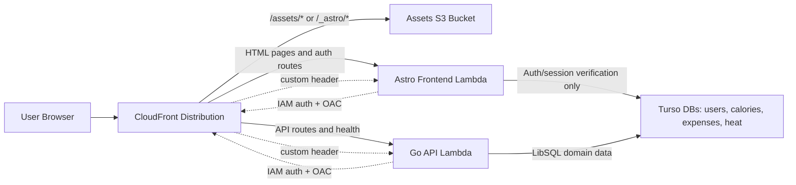

# Architecture

This document defines the macro system flow and the strict boundaries between frontend, server, and infrastructure. It is a constraint for future changes.

## Request Flow (Current Hybrid Migration)



Key points:
- CloudFront is the single public entrypoint.
- Static assets (`/assets/*`, `/_astro/*`) are served from S3 with optimized caching.
- Page rendering and frontend auth stay in the Astro runtime.
- Business routes and health checks are served by the Go runtime.
- CloudFront adds origin verification headers and the Lambda entrypoints remain private behind CloudFront.

## Go Backend Shape

The Go backend is the long-term source of truth for domain logic and API contracts.

Current implemented layout in `apps/server/`:

```text
apps/server/
├── cmd/
│   └── server/              # HTTP server entrypoint used in local/container runs
├── internal/
│   ├── core/                # config, db, logging
│   ├── modules/             # domain logic, DTOs, ports, db adapters
│   ├── transport/
│   │   └── http/            # router, middleware, handlers, OpenAPI
│   └── wiring/              # composition helpers per domain
```

Target expansion path for later phases:

- `cmd/lambda/` for the serverless production entrypoint
- `cmd/service/<domain>/` only if domains are extracted into separate services

### Backend Principles

- Hexagonal architecture: domain logic lives in `internal/modules/**`; transport and runtime wiring stay outside modules.
- Stateless compute: runtime state lives in Turso; no local-disk dependency is part of the design contract.
- Transport isolation: HTTP, Lambda, and any future service transport must reuse the same module services.
- Environment-driven database mode: Turso DSNs are selected from config so the same backend can run in local/container and serverless environments.

### Module Contract

Each domain module follows the same shape:

```text
internal/modules/<domain>/
├── ports.go
├── types.go
├── service.go
└── adapters/
    └── db/
```

Hard boundaries:

- Modules do not import transport or AWS packages.
- Transport depends on modules, never the reverse.
- DB adapters implement module ports.
- Cross-domain access should go through ports owned by the consuming module.
- If domains are split later, outbound adapters live with the consumer and inbound transport adapters live with the provider.

### Transport Contract

The current Go transport is JSON-over-HTTP under `/api/*`.

- Router: `apps/server/internal/transport/http/router.go`
- OpenAPI: `GET /openapi.yaml`
- Auth middleware: cookie-based session auth in `apps/server/internal/transport/http/middleware_auth.go`, applied only to protected route groups under `/api/*`
- Response helpers: `apps/server/internal/transport/http/response.go`
- Canonical expenses routes: `/api/expenses/settings`, `/api/expenses/sheet/current`, `/api/expenses/entries`, `/api/expenses/checklists`, `/api/expenses/checklists/complete`, `/api/expenses/recurring`, `/api/expenses/sheet/close`

Current error contract is intentionally simple:

- HTTP status carries the main classification
- JSON errors use `{ "error": "..." }`
- Go auth endpoints under `/api/auth/*` are JSON API endpoints; frontend redirect/form behavior is handled by the web app adapters

If a richer typed API error contract is introduced later, update this doc and the transport tests together.

### Auth Contract

Go is now the source of truth for:

- `POST /api/auth/login`
- `POST /api/auth/logout`
- `GET /api/auth/session`
- authenticated API access under `/api/*`

Astro still owns request-local SSR auth context for most protected pages, but page-session verification now delegates to Go and the browser can bootstrap session state directly from `GET /api/auth/session`. The home dashboard is the first protected read path already loading directly from Go in the browser.

## Environment Variables

### Frontend runtime (Astro Lambda)

These are injected into the frontend runtime and resolved at runtime.

Origin verification:
- `ORIGIN_VERIFY_HEADER` (default: `X-Origin-Verify`)
- `ORIGIN_VERIFY_VALUE` (random secret stored in SSM)

Astro application request handling should not connect to Turso directly.

Auth cookies:
- `AUTH_COOKIE_NAME` (default `trackstack_session`)
- `AUTH_COOKIE_SECURE` (default `true` in prod)
- `AUTH_COOKIE_SAMESITE` (default `lax`)

Auth session timing:
- `AUTH_SESSION_IDLE_SECONDS` (default `1800`)
- `AUTH_SESSION_ABSOLUTE_SECONDS` (default `86400`)
- `AUTH_SESSION_ROTATE_AFTER_SECONDS` (default `1800`)
- `AUTH_SESSION_ROTATION_GRACE_SECONDS` (default `300`)
- `AUTH_SESSION_TOUCH_SECONDS` (default `300`)

Runtime SSM prefix (serverless):
- `/trackstack/serverless/runtime/*` (set via `infra/environments/serverless/01-set-runtime-ssm.sh`)

### Frontend

Public or local frontend integration variables:
- `PUBLIC_API_BASE_URL` for browser-side API submission targets when needed
- `API_PROXY_URL` for Astro server-side proxying to the Go backend in local/container workflows

In local/container development, browser requests should keep using same-origin `/api` paths and rely on the frontend dev proxy. `PUBLIC_API_BASE_URL` is for production-style direct browser access.

### Go API runtime

The Go backend reads its own runtime config from `apps/server/internal/core/config/config.go`, including:
- `PORT`
- `CORS_ALLOWED_ORIGIN`
- `AUTH_COOKIE_NAME`
- `AUTH_COOKIE_SECURE`
- `AUTH_COOKIE_SAMESITE`
- `AUTH_SESSION_IDLE_SECONDS`
- `AUTH_SESSION_ABSOLUTE_SECONDS`
- `AUTH_SESSION_ROTATE_AFTER_SECONDS`
- `AUTH_SESSION_ROTATION_GRACE_SECONDS`
- `AUTH_SESSION_TOUCH_SECONDS`
- domain-specific Turso connection values for auth, users, calories, expenses, and heat

Backend-owned commands under `apps/server/cmd/**` use the same config surface for direct database tooling such as user seeding.

Astro reads the same auth env keys from `apps/web/src/server/auth/config.ts`, and its defaults are intentionally kept in lockstep with the Go runtime.

### CI/CD (deploy workflow)

The deploy workflow loads infra outputs from SSM:
- `/trackstack/serverless/infra/assets_bucket`
- `/trackstack/serverless/infra/artifacts_bucket`
- `/trackstack/serverless/infra/lambda_key`
- `/trackstack/serverless/infra/lambda_function_name`
- `/trackstack/serverless/infra/cloudfront_distribution_id`

## High-Level Deployment Process

### Infrastructure (Terraform)
- `infra/environments/serverless` is the production baseline.
- `terraform-serverless.yml` runs `terraform plan` on main; `apply` and `destroy` are manual via workflow dispatch.
- Optional bootstrap artifact build produces an initial Lambda zip for first apply.

### Application (Astro Frontend + Go Backend)
- `deploy-serverless.yml` runs on main when frontend, backend, or migrations change.
- If migrations changed, Atlas applies Turso migrations first (users → expenses → heat → calories).
- Astro build outputs:
  - Static assets in `apps/web/dist/client`
  - server bundle in `apps/web/dist/server`
- The frontend bundle is published separately from the Go API runtime.
- Local development uses `docker-compose.yml` at repo root to run both runtimes together.
- Static assets are synced to S3 with long-lived cache headers.
- CloudFront cache is invalidated to publish updates.

## Architecture Boundaries (Macro)

- CloudFront is the only public ingress.
- Astro owns page rendering and temporary frontend-facing auth flows.
- Go owns health plus the business API routes and their transport tests.
- Turso is the only persistent store; all compute is stateless.
- Runtime secrets come from SSM; no hardcoded secrets in code or Terraform.
