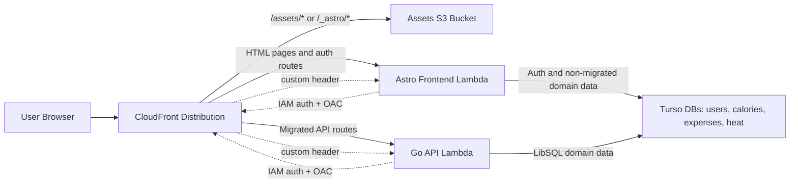

# Architecture

This document defines the macro system flow and the strict boundaries between frontend, server, and infrastructure. It is a constraint for future changes.

## Request Flow (Current Hybrid Migration)

Key points:
- CloudFront is the single public entrypoint.
- Static assets (`/assets/*`, `/_astro/*`) are served from S3 with optimized caching.
- Page rendering and frontend auth stay in the Astro runtime.
- Migrated business routes are served by the Go runtime; remaining domain routes still live in Astro until each slice is moved.
- CloudFront adds origin verification headers and the Lambda entrypoints remain private behind CloudFront.

## Environment Variables

### Frontend runtime (Astro Lambda)

These are injected into the frontend runtime and resolved at runtime.

Origin verification:
- `ORIGIN_VERIFY_HEADER` (default: `X-Origin-Verify`)
- `ORIGIN_VERIFY_VALUE` (random secret stored in SSM)

Turso connections used by Astro auth and supporting server logic (values are SSM parameter paths, resolved at runtime by `apps/web/src/server/db/sqlite.ts`):
- `TURSO_USERS_URL`
- `TURSO_USERS_TOKEN`

Auth cookies:
- `AUTH_COOKIE_NAME` (default `session`)
- `AUTH_COOKIE_SECURE` (default `true` in prod)
- `AUTH_COOKIE_SAMESITE` (default `lax`)

Auth session timing:
- `AUTH_SESSION_IDLE_SECONDS`
- `AUTH_SESSION_ABSOLUTE_SECONDS`
- `AUTH_SESSION_ROTATE_AFTER_SECONDS`
- `AUTH_SESSION_ROTATION_GRACE_SECONDS`
- `AUTH_SESSION_TOUCH_SECONDS`

Runtime SSM prefix (serverless):
- `/trackstack/serverless/runtime/*` (set via `infra/environments/serverless/01-set-runtime-ssm.sh`)

### Frontend

Public or local frontend integration variables:
- `PUBLIC_API_BASE_URL` for browser-side API submission targets when needed
- `API_PROXY_URL` for Astro server-side proxying to the Go backend in local/container workflows

### Go API runtime

The Go backend reads its own runtime config from `apps/server/internal/core/config/config.go`, including:
- `PORT`
- `CORS_ALLOWED_ORIGIN`
- `AUTH_COOKIE_NAME`
- `AUTH_COOKIE_SECURE`
- `AUTH_COOKIE_SAMESITE`
- domain-specific Turso connection values for auth, users, calories, expenses, and heat

### CI/CD (deploy workflow)

The deploy workflow loads infra outputs from SSM:
- `/trackstack/serverless/infra/assets_bucket`
- `/trackstack/serverless/infra/artifacts_bucket`
- `/trackstack/serverless/infra/lambda_key`
- `/trackstack/serverless/infra/lambda_function_name`
- `/trackstack/serverless/infra/cloudfront_distribution_id`

## High-Level Deployment Process

### Infrastructure (Terraform)
- `infra/environments/serverless` is the production baseline.
- `terraform-serverless.yml` runs `terraform plan` on main; `apply` and `destroy` are manual via workflow dispatch.
- Optional bootstrap artifact build produces an initial Lambda zip for first apply.

### Application (Astro Frontend + Go Backend)
- `deploy-serverless.yml` runs on main when frontend, backend, or migrations change.
- If migrations changed, Atlas applies Turso migrations first (users → expenses → heat → calories).
- Astro build outputs:
  - Static assets in `apps/web/dist/client`
  - server bundle in `apps/web/dist/server`
- The frontend bundle is published separately from the Go API runtime.
- Local development uses `docker-compose.yml` at repo root to run both runtimes together.
- Static assets are synced to S3 with long-lived cache headers.
- CloudFront cache is invalidated to publish updates.

## Architecture Boundaries (Macro)

- CloudFront is the only public ingress.
- Astro owns page rendering, frontend-facing auth flows, and any domain routes not migrated yet.
- Go owns the migrated business API routes and their transport tests.
- Turso is the only persistent store; all compute is stateless.
- Runtime secrets come from SSM; no hardcoded secrets in code or Terraform.
