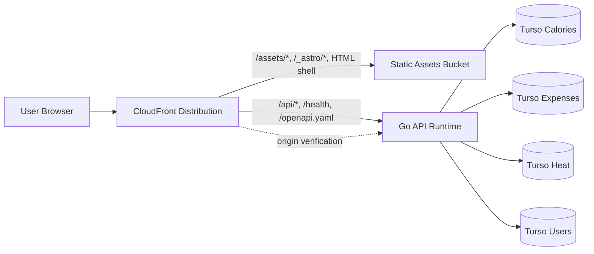

# Architecture

This document defines the Trackstack system shape, the backend target vocabulary, and the current migration status. It replaces the need for a separate backend target note.

The rebuilt backend now lives at `apps/server`. Intentional frontend/backend contract breaks are tracked separately in `docs/BACKEND_BREAKING_CHANGES.md`.

## System Flow



Key points:

- CloudFront is the only public ingress in serverless environments.
- Astro is shipped as static assets from S3.
- Go owns health, OpenAPI, auth, and business API routes.
- The Go runtime is stateless; persistent state lives only in Turso.
- The same assembled backend contract must run locally and in Lambda.

## Source Of Truth

- `apps/web` owns pages, layouts, browser interaction, and the static frontend shell.
- `apps/server` owns backend contracts, domain rules, auth issuance/verification, and backend-owned tooling.
- Historical references to the legacy compatibility backend remain in migration notes only; the repository path `apps/server` now refers to the rebuilt backend described here.
- Frontend pages should talk to Go-owned `/api/*` endpoints rather than direct databases or Astro-owned API adapters.

## Reference Backend Shape

The target backend structure is the one implemented in `apps/server`:

```text
apps/server/
├── cmd/
│   ├── lambda/                    # AWS Lambda custom-runtime entrypoint
│   ├── seed-user/                 # backend-owned db tooling for e2e/local flows
│   └── server/                    # local/container HTTP entrypoint
└── internal/
    ├── app/
    │   └── bootstrap/             # composition root, router, openapi, module builders
    ├── contexts/
    │   ├── auth/
    │   ├── calories/
    │   ├── expenses/
    │   ├── heat/
    │   └── users/
    └── platform/
        ├── authcontext/           # request-scope identity handoff at transport boundary
        ├── aws/
        │   └── functionurl/       # Lambda Function URL adapter
        ├── config/
        ├── db/
        ├── logging/
        ├── middleware/
        └── timeutil/
```

Possible expansion path later, only if justified:

- `cmd/service/<domain>/` for extracted runtimes
- more outbound adapters under `contexts/<name>/adapters/outbound/`
- more inbound adapters under `contexts/<name>/adapters/inbound/`

## Backend Vocabulary

### `platform/`

Shared technical building blocks used across contexts.

Examples:

- config loading and validation
- database opening and pooling
- logging
- shared middleware
- AWS runtime adapters
- time helpers and transport-scoped auth context helpers

`platform` must never become a hidden business-logic bucket.

### `app/bootstrap/`

The composition root.

Responsibilities:

- load config
- open all required database pools
- build context modules
- create the shared router
- expose one assembled `http.Handler`
- serve shared runtime endpoints like `/health` and `/openapi.yaml`

`bootstrap` is allowed to know the full concrete dependency graph. Context packages are not.

The current assembly pattern is intentionally split by concern:

- `database.go` opens and closes domain database pools
- `*_module.go` wires each context vertically
- `router.go` mounts global middleware and route groups
- `runtime.go` returns the assembled runtime used by both `cmd/monolith-api` and `cmd/lambda`

### `contexts/<name>/domain/`

Pure business concepts and invariants.

Examples:

- entities and value objects
- domain-specific validation rules
- domain errors
- logic that should survive transport or persistence changes

The domain must not know about HTTP, Lambda, SQL drivers, Chi, or AWS packages.

### `contexts/<name>/application/ports/`

Interfaces owned by the application layer.

- inbound ports define use cases the adapters can call
- outbound ports define what the use cases need from infrastructure
- command/query structs carry explicit typed inputs when a use case needs more than a primitive

Ports should stay narrow and use-case-shaped.

### `contexts/<name>/application/services/`

Use cases and orchestration.

Application services may:

- validate commands and queries
- coordinate repositories and external dependencies
- build read models
- apply domain rules
- materialize explicit defaults when that behavior is part of the contract

Application services must not parse HTTP or contain SQL details.

### `contexts/<name>/adapters/inbound/`

Entry points into the application.

Today this is mainly HTTP. Later it could include async consumers or service-specific transports.

Inbound adapters should stay thin:

- mount their own subroutes
- parse and validate transport input
- extract the authenticated user at the boundary
- call one use case
- map the result into HTTP status + JSON

Note: request context may carry authenticated identity resolved by middleware, but handlers are still responsible for turning that into explicit application inputs.

### `contexts/<name>/adapters/outbound/`

Technical implementations of outbound ports.

Today this is mostly Turso/libSQL access. These packages own SQL and persistence details, not business decisions.

## Dependency Rules

The dependency direction is strict:

`inbound adapters -> application -> domain`

`application -> outbound ports <- outbound adapters`

Rules:

- contexts must not import `bootstrap`
- domain packages must not import transport or AWS packages
- handlers depend on application ports, never the reverse
- outbound adapters implement application-owned ports
- compatibility shims belong at the transport boundary, not in domain logic
- middleware may inject authenticated identity into request context, but application services still receive explicit `userID` values from handlers
- prefer explicit commands and queries over hidden inputs
- prefer explicit create/bootstrap flows; if a read path materializes defaults, document it and test it as part of the contract

## Runtime Assembly

The shared runtime is built once in `apps/server/internal/app/monolithapi` and reused by all deployment targets.

### Local HTTP Runtime

- `apps/server/cmd/monolith-api/main.go` is intentionally thin
- it loads `.env`, builds the runtime, starts `http.Server`, and handles graceful shutdown

### Lambda Runtime

- `apps/server/cmd/lambda/main.go` is intentionally thin
- it builds the same runtime and passes the assembled `http.Handler` into `apps/server/internal/platform/aws/functionurl`
- the Function URL adapter is a deployment/runtime concern, not a domain transport concern

### Backend-Owned Tooling

- `apps/server/cmd/seed-user` creates or updates the e2e/local test user directly in the users database
- backend-owned CLI tools may reuse the same runtime config family without needing the full HTTP runtime

## Authentication And Identity Flow

`apps/server` uses bearer access tokens plus stateful refresh sessions.

Flow:

1. `POST /api/auth/login` verifies credentials through the users context, creates a refresh session in `users.sessions`, returns a signed access JWT, and sets an `HttpOnly` refresh cookie.
2. `POST /api/auth/refresh` accepts only the refresh cookie, rotates the refresh session, and returns a new access JWT plus a rotated cookie.
3. `ResolveSession` middleware validates bearer auth locally using `JWT_SECRET`. In direct/local runtimes it reads `Authorization: Bearer <jwt>`; in the CloudFront + Lambda Function URL deployment it also accepts `X-Trackstack-Authorization: Bearer <jwt>` because the origin request uses `Authorization` for SigV4 signing.
4. The middleware injects `userID` and `sessionID` into request context through `platform/authcontext`.
5. Inbound handlers read that identity and pass explicit values into application commands and queries.
6. Domain and application layers never parse bearer headers, and non-auth routes never treat the refresh cookie as proof of identity.

Design note:

- the current `platform/authcontext` helper is an intentional transport-boundary convenience, not permission for application services to read hidden request values directly.
- the desired rule remains: handlers extract request-scoped identity and pass explicit `userID` values into use cases.

Current auth contract:

- `POST /api/auth/login` returns JSON with `accessToken`, `tokenType`, `expiresAt`, and `userId`, and sets a refresh cookie
- `POST /api/auth/refresh` rotates the refresh cookie and returns the same JSON token shape as login
- `GET /api/auth/session` requires bearer auth
- `POST /api/auth/logout` revokes the presented refresh session, clears the refresh cookie, and returns `204`
- protected domain routes under `/api/calories/*`, `/api/expenses/*`, and `/api/heat/*` require bearer auth

Current frontend note:

- `apps/web` now stores the bearer token client-side after login, replays it during auth bootstrap, and uses the same auth contract for protected browser reads and mutations.

## Transport Contract

The backend transport is JSON-over-HTTP.

Global runtime endpoints:

- `GET /health`
- `GET /api/health`
- `GET /openapi.yaml`

Auth endpoints:

- `POST /api/auth/login`
- `POST /api/auth/refresh`
- `POST /api/auth/logout`
- `GET /api/auth/session`

Heat endpoints:

- `GET /api/heat/dashboard`
- `GET /api/heat/refills`
- `POST /api/heat/refills`
- `DELETE /api/heat/refills/{id}`

Calories endpoints:

- `GET /api/calories/dashboard`
- `GET /api/calories/target`
- `POST /api/calories/target`
- `POST /api/calories/log`
- `DELETE /api/calories/logs/{id}`

Expenses endpoints:

- `GET /api/expenses/settings`
- `POST /api/expenses/settings`
- `GET /api/expenses/sheet/current`
- `POST /api/expenses/entries`
- `DELETE /api/expenses/entries/{id}`
- `POST /api/expenses/checklists`
- `DELETE /api/expenses/checklists/{id}`
- `POST /api/expenses/checklists/complete`
- `POST /api/expenses/recurring`
- `DELETE /api/expenses/recurring/{id}`
- `POST /api/expenses/sheet/close`

Shared transport rules:

- HTTP status carries the main error classification
- JSON errors use `{ "error": "..." }`
- CORS is configured globally at the router level
- OpenAPI is served by the backend and must stay in sync with the route surface
- the aggregate `GET /api/dashboard` route is intentionally removed from `apps/server`

Intentional compatibility breaks live in `docs/BACKEND_BREAKING_CHANGES.md`, not in this file.

## Current Context Status

The reference backend shape is no longer hypothetical. `apps/server` currently includes:

- `auth`
- `users`
- `heat`
- `calories`
- `expenses`

Current replacement-oriented runtime capabilities:

- shared bootstrap-based assembly
- local HTTP entrypoint
- Lambda entrypoint
- CORS middleware
- OpenAPI endpoint
- backend-owned user seeding command
- curl-based end-to-end smoke coverage in `apps/server/scripts/e2e.sh`

Current intentional gaps vs the legacy backend:

- the old aggregate `/api/dashboard` route is not carried forward
- accepted route/payload differences are documented in `docs/BACKEND_BREAKING_CHANGES.md`

## Environment Variables

### Frontend

Frontend/browser integration values:

- `PUBLIC_API_BASE_URL`
- `API_PROXY_URL`

In local development, browser requests should stay same-origin and rely on the frontend proxy where applicable.

### Backend Runtime

The `apps/server` runtime currently depends on:

- `APP_ENV`
- `PORT`
- `LOG_LEVEL`
- `CORS_ALLOWED_ORIGIN`
- `JWT_SECRET`
- `TURSO_CALORIES_URL_HTTP`
- `TURSO_CALORIES_TOKEN`
- `TURSO_EXPENSES_URL_HTTP`
- `TURSO_EXPENSES_TOKEN`
- `TURSO_HEAT_URL_HTTP`
- `TURSO_HEAT_TOKEN`
- `TURSO_USERS_URL_HTTP`
- `TURSO_USERS_TOKEN`
- `DB_MAX_OPEN_CONNS`
- `DB_MAX_IDLE_CONNS`
- `DB_CONN_MAX_LIFETIME_SECONDS`
- `DB_CONN_MAX_IDLE_TIME_SECONDS`

Backend-owned commands under `apps/server/cmd/**` should align with this same runtime family unless a command intentionally narrows the required config surface.

### CI/CD And Runtime Secrets

- serverless runtime secrets come from SSM
- no secrets should be hardcoded in code or Terraform
- `serverless-next` must provide `JWT_SECRET` in addition to domain database credentials

## Deployment Shape

The architecture must support multiple runtimes without changing context business logic.

Current required runtimes:

- local HTTP server
- AWS Lambda Function URL runtime

Current split-validation runtime:

- `cmd/calories-api` for the standalone calories service process
- `cmd/expenses-api` for the standalone expenses service process
- `cmd/identity-api` for the standalone identity service process
- `cmd/heat-api` for the standalone heat service process
- `docker-compose.microservices.yml` for running the extracted services beside the monolithic frontend, with a local edge proxy routing business API traffic directly to the split services and serving health locally

Possible later runtime:

- extracted service per approved service boundary

Deployment rules:

- `cmd/monolith-api` and `cmd/lambda` stay thin
- runtime-specific adapters stay in `platform/`, not in contexts
- contexts must not import server or Lambda packages
- static frontend deployment stays separate from the Go API runtime

## Approved Service Boundaries

The next extraction step is not "one service per package because microservices are trendy." The approved service seams are:

- `identity` service = `auth` + `users`
- `calories` service
- `expenses` service
- `heat` service

Rationale:

- `calories`, `expenses`, and `heat` already behave like strong domain boundaries
- `auth` and `users` do not currently behave like independent runtime boundaries and should be extracted together as one identity boundary
- the service split should happen at runtime assembly boundaries, not by tearing apart context-internal hexagonal structure that is already working

Identity rules:

- the `identity` service owns login and JWT issuance
- `users` remains a separate internal hexagon inside the identity service rather than a separate microservice
- the `identity` service is not an API gateway

JWT verification rules for the split:

- each protected domain service validates JWTs locally
- handlers still extract `userID` from verified claims and pass it explicitly into application commands and queries
- domain services must not make a network call to `identity` on every request just to validate a token
- if a service needs user data beyond JWT claims, it should call `identity` explicitly for that specific use case

Expected first extracted runtimes:

- `cmd/identity-api`
- `cmd/calories-api`
- `cmd/expenses-api`
- `cmd/heat-api`

The first extracted runtime now exists for local split validation:

- `apps/server/cmd/calories-api`
- `apps/server/cmd/expenses-api`
- `apps/server/cmd/identity-api`
- `apps/server/cmd/heat-api`

## Macro Boundaries

- CloudFront is the only public ingress in serverless environments.
- Astro owns the static frontend shell and browser runtime.
- Go owns auth, health, OpenAPI, and all business API routes.
- Turso is the only persistent store.
- Compute is stateless.
- Secrets come from environment or SSM, never from checked-in infra/code.
- `platform/` may hold technical helpers, but never domain rules.
