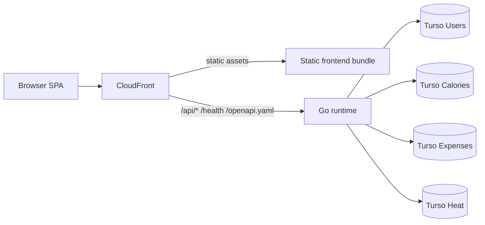

# Architecture

This is the current system shape of TrackStack.

If you are new here, read this file with `docs/MASTERPLAN.md`, then read `docs/APPLICATION.md` for the frontend and feature map.

## Source Of Truth

- Active frontend: `apps/web`
- Active backend: `apps/server`
- Backend contract source: `apps/server/internal/app/monolithapi/openapi.yaml`
- Generated frontend contract types: `apps/web/src/core/api/generated/schema.ts`
- Persistent state: four Turso databases (`users`, `calories`, `expenses`, `heat`)

There is no `apps/web-next` app in the current repo. If you see docs claiming otherwise, they are stale.

## System Shape



Key rules:

- The browser never talks to Turso directly.
- Go owns auth, health, OpenAPI, and all business endpoints.
- The same business code must survive local, Lambda, and split-runtime deployments.
- Production stays serverless and cheap; split services are a lab seam, not the default money burner.

## Backend Layout

```text
apps/server/
├── cmd/
│   ├── monolith-api/      # local/container HTTP server
│   ├── lambda/            # Lambda entrypoint using the same monolith handler
│   ├── identity-api/      # split-runtime validation: auth + users
│   ├── calories-api/      # split-runtime validation
│   ├── expenses-api/      # split-runtime validation
│   ├── heat-api/          # split-runtime validation
│   └── seed-user/         # backend-owned CLI tooling
└── internal/
    ├── app/
    │   ├── monolithapi/   # actual monolith composition root
    │   ├── authruntime/   # shared auth assembly
    │   ├── identityapi/   # split identity runtime
    │   ├── caloriesapi/   # split calories runtime
    │   ├── expensesapi/   # split expenses runtime
    │   └── heatapi/       # split heat runtime
    ├── contexts/
    │   ├── auth/
    │   ├── users/
    │   ├── calories/
    │   ├── expenses/
    │   └── heat/
    └── platform/
        ├── authcontext/
        ├── aws/functionurl/
        ├── config/
        ├── db/
        ├── logging/
        ├── middleware/
        └── timeutil/
```


## Backend Boundaries

Each business context follows the same shape:

```text
contexts/<name>/
├── adapters/
│   ├── inbound/http/
│   └── outbound/db/
├── application/
│   ├── ports/
│   └── services/
└── domain/
```

Dependency direction:

- `adapters/inbound -> application -> domain`
- `application -> application ports <- adapters/outbound`
- `internal/app/*` is allowed to wire concrete implementations together
- `platform/` holds technical plumbing only, not business rules

What is true today:

- Handlers are thin and pass explicit `userID` values into use cases.
- Outbound repositories implement application-owned ports.
- `users` is a supporting context inside the identity boundary, not an independent public API.
- The code is hexagonal enough to move across runtimes, but it is still pragmatic Go, not rich textbook DDD.

## Runtime Matrix

### Monolith

- `apps/server/cmd/monolith-api/main.go` starts the local/container HTTP server.
- `apps/server/internal/app/monolithapi/runtime.go` loads config, connects databases, wires modules, and returns one `http.Handler`.

### Lambda

- `apps/server/cmd/lambda/main.go` builds the same monolith runtime.
- `apps/server/internal/platform/aws/functionurl/handler.go` adapts that `http.Handler` to Lambda Function URLs.

This is the strongest write-once-run-anywhere path in the repo today.

### Split Runtimes

- `apps/server/cmd/identity-api`
- `apps/server/cmd/calories-api`
- `apps/server/cmd/expenses-api`
- `apps/server/cmd/heat-api`

These reuse the same contexts and use cases, but each runtime has its own config loading, router wiring, and DB bootstrapping package under `internal/app/*api`.

That means:

- business logic is reusable across deployment targets
- runtime assembly is still duplicated enough to drift if you are careless

## Approved Service Boundaries

If the monolith is split, the approved seams are:

- `identity` = `auth` + `users`
- `calories`
- `expenses`
- `heat`

Do not split `users` away from `auth` just because microservices give some people brain worms.

## Authentication And Transport

Auth flow:

1. `POST /api/auth/login` verifies credentials through the identity boundary.
2. The backend returns an access JWT and sets an `HttpOnly` refresh cookie.
3. `POST /api/auth/refresh` rotates the refresh session and returns a fresh access token.
4. `POST /api/auth/logout` revokes the refresh session and clears the cookie.
5. `GET /api/auth/session` verifies the bearer token and returns the current session identity.

Transport rules:

- JSON over HTTP is the canonical API contract.
- Global endpoints: `GET /health`, `GET /api/health`, `GET /openapi.yaml`
- Protected routes use bearer auth.
- In local/direct flows the backend accepts `Authorization: Bearer <jwt>`.
- In the CloudFront -> Lambda Function URL path it also accepts `X-Trackstack-Authorization: Bearer <jwt>` because CloudFront reserves `Authorization` for SigV4 signing.
- Error payloads use `{ "error": "..." }`.

## Current Domain Surface

Auth:

- `POST /api/auth/login`
- `POST /api/auth/refresh`
- `POST /api/auth/logout`
- `GET /api/auth/session`

Calories:

- `GET /api/calories/dashboard`
- `GET /api/calories/target`
- `POST /api/calories/target`
- `POST /api/calories/log`
- `DELETE /api/calories/logs/{id}`

Expenses:

- `GET /api/expenses/settings`
- `POST /api/expenses/settings`
- `GET /api/expenses/sheet/current`
- `POST /api/expenses/entries`
- `DELETE /api/expenses/entries/{id}`
- `POST /api/expenses/checklists`
- `DELETE /api/expenses/checklists/{id}`
- `POST /api/expenses/checklists/complete`
- `POST /api/expenses/recurring`
- `DELETE /api/expenses/recurring/{id}`
- `POST /api/expenses/sheet/close`

Heat:

- `GET /api/heat/dashboard`
- `GET /api/heat/refills`
- `POST /api/heat/refills`
- `DELETE /api/heat/refills/{id}`

For exact request and response shapes, treat `apps/server/internal/app/monolithapi/openapi.yaml` as the source of truth.

## Environment Variables

Shared backend runtime config currently includes:

- `APP_ENV`
- `PORT`
- `LOG_LEVEL`
- `CORS_ALLOWED_ORIGIN`
- `JWT_SECRET`
- `ACCESS_TOKEN_TTL_MINUTES`
- `REFRESH_TOKEN_TTL_HOURS`
- `REFRESH_TOKEN_ABSOLUTE_TTL_HOURS`
- `REFRESH_COOKIE_NAME`
- `REFRESH_COOKIE_SECURE`
- `REFRESH_COOKIE_DOMAIN`
- `TURSO_USERS_URL_HTTP`
- `TURSO_USERS_TOKEN`
- `TURSO_CALORIES_URL_HTTP`
- `TURSO_CALORIES_TOKEN`
- `TURSO_EXPENSES_URL_HTTP`
- `TURSO_EXPENSES_TOKEN`
- `TURSO_HEAT_URL_HTTP`
- `TURSO_HEAT_TOKEN`
- `DB_MAX_OPEN_CONNS`
- `DB_MAX_IDLE_CONNS`
- `DB_CONN_MAX_LIFETIME_SECONDS`
- `DB_CONN_MAX_IDLE_TIME_SECONDS`

Serverless secrets come from environment or SSM. Never hardcode them.

## Cost And Performance Reality

Good news:

- Monolith and Lambda share the same assembled handler.
- Split runtimes only open the one database they need.
- The backend stays stateless apart from Turso.
- Database handles are opened lazily.

Current pain points:

- Default pool settings are fine locally but a bit fat for cold-start-sensitive serverless traffic.
- Split runtime assembly duplicates config/router/health wiring across packages.

If you are optimizing for side-project cost, keep production on the serverless monolith unless the split runtimes prove something worth paying for.

## Known Architectural Debt

- Some read paths materialize defaults on first access:
  - calories target
  - expenses settings
  - expenses open sheet
- Domain models are mostly pragmatic data structures plus validation/errors, not rich aggregates.
- Auth updates `last_login` asynchronously after login; acceptable, but worth remembering in short-lived runtimes.
- Split runtimes prove portability, but they are not yet assembled from a truly shared runtime kernel.

## Onboarding Short Path

If you need to start working quickly:

1. Read `docs/MASTERPLAN.md` for the deployment philosophy.
2. Read this file for backend and runtime boundaries.
3. Read `docs/APPLICATION.md` for the SPA, feature structure, and frontend transport rules.
4. Read `apps/server/internal/app/monolithapi/openapi.yaml` for the exact API surface.
5. Only then start editing a context or feature.
