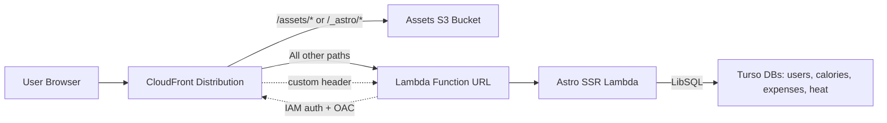

# Architecture

This document defines the macro system flow and the strict boundaries between frontend, server, and infrastructure. It is a constraint for future changes.

## Request Flow (Serverless Prod)

Key points:
- CloudFront is the single public entrypoint.
- Static assets (`/assets/*`, `/_astro/*`) are served from S3 with optimized caching.
- All other routes (pages + `/api/*`) go to the Lambda Function URL.
- CloudFront adds an origin verification header; the Astro middleware rejects requests without it.
- Lambda Function URL is IAM-authenticated and only invokable by CloudFront.

## Environment Variables

### Server-side runtime (Lambda)

These are injected into the Lambda environment in `infra/modules/lambda-api` and resolved at runtime.

Origin verification:
- `ORIGIN_VERIFY_HEADER` (default: `X-Origin-Verify`)
- `ORIGIN_VERIFY_VALUE` (random secret stored in SSM)

Turso connections (values are SSM parameter paths, resolved at runtime by `apps/web/src/server/db/sqlite.ts`):
- `TURSO_USERS_URL`
- `TURSO_USERS_TOKEN`
- `TURSO_CALORIES_URL`
- `TURSO_CALORIES_TOKEN`
- `TURSO_EXPENSES_URL`
- `TURSO_EXPENSES_TOKEN`
- `TURSO_HEAT_URL`
- `TURSO_HEAT_TOKEN`

Auth cookies:
- `AUTH_COOKIE_NAME` (default `session`)
- `AUTH_COOKIE_SECURE` (default `true` in prod)
- `AUTH_COOKIE_SAMESITE` (default `lax`)

Auth session timing:
- `AUTH_SESSION_IDLE_SECONDS`
- `AUTH_SESSION_ABSOLUTE_SECONDS`
- `AUTH_SESSION_ROTATE_AFTER_SECONDS`
- `AUTH_SESSION_ROTATION_GRACE_SECONDS`
- `AUTH_SESSION_TOUCH_SECONDS`

Runtime SSM prefix (serverless):
- `/trackstack/serverless/runtime/*` (set via `infra/environments/serverless/01-set-runtime-ssm.sh`)

### Frontend

No public (`PUBLIC_`) environment variables are currently used. Astro pages and components access data via server-side logic only.

### CI/CD (deploy workflow)

The deploy workflow loads infra outputs from SSM:
- `/trackstack/serverless/infra/assets_bucket`
- `/trackstack/serverless/infra/artifacts_bucket`
- `/trackstack/serverless/infra/lambda_key`
- `/trackstack/serverless/infra/lambda_function_name`
- `/trackstack/serverless/infra/cloudfront_distribution_id`

## High-Level Deployment Process

### Infrastructure (Terraform)
- `infra/environments/serverless` is the production baseline.
- `terraform-serverless.yml` runs `terraform plan` on main; `apply` and `destroy` are manual via workflow dispatch.
- Optional bootstrap artifact build produces an initial Lambda zip for first apply.

### Application (Astro SSR + Static Assets)
- `deploy-serverless.yml` runs on main when `apps/web/**` or migrations change.
- If migrations changed, Atlas applies Turso migrations first (users → expenses → heat → calories).
- Astro build outputs:
  - Static assets in `apps/web/dist/client`
  - SSR bundle in `apps/web/dist/server`
- The SSR bundle is zipped and uploaded to the artifacts bucket, then used to update the Lambda function.
- Static assets are synced to S3 with long-lived cache headers.
- CloudFront cache is invalidated to publish updates.

## Architecture Boundaries (Macro)

- CloudFront is the only public ingress.
- Lambda is the only dynamic runtime for SSR + API routes.
- Turso is the only persistent store; all compute is stateless.
- Runtime secrets come from SSM; no hardcoded secrets in code or Terraform.
